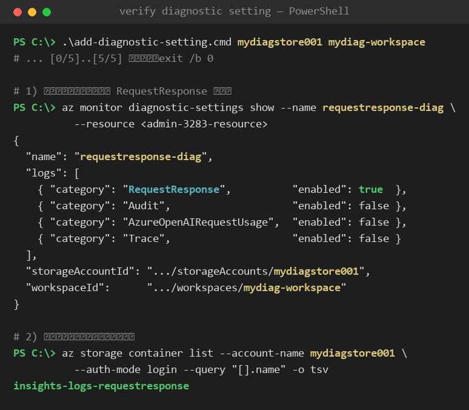
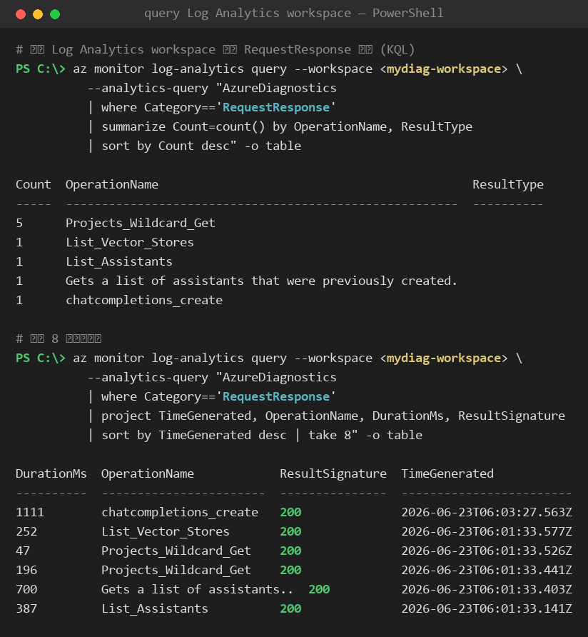
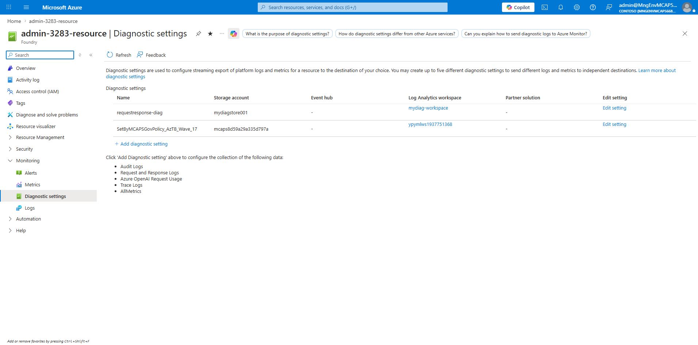
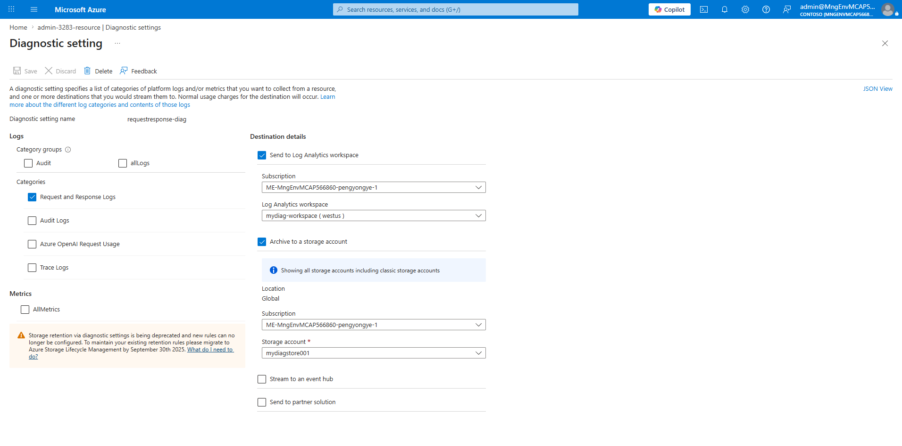
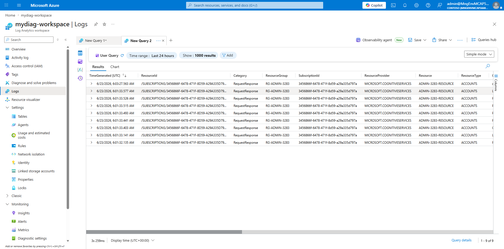

# azure-diagnostic-setting

一个 Windows CMD 脚本，为指定的 Azure 资源添加 **Diagnostic Setting（诊断设置）**，仅采集 `RequestResponse` 日志，并同时归档到 **Storage Account** 与 **Log Analytics workspace**。

脚本以 Azure CLI 实现，**幂等**（可重复执行），并自动完成存储账户与工作区的"存在性检查 + 按需创建"。

---

## 功能概述

- 根据**资源名称**自动解析资源 ID、资源组（Resource Group）与区域（Location）。
- 同名资源检测：若订阅内存在多个同名资源，会报错并列出匹配项，避免误操作。
- **Storage Account**
  - 不存在则创建（`StorageV2` / `Standard_LRS`）。
  - 创建时**禁用 Shared Key**（`--allow-shared-key-access false`），仅 Entra ID 鉴权；已存在则强制校正为禁用。
  - 配置**生命周期规则**：`insights-logs-*` 容器中的诊断日志在 `RETENTION_DAYS`（默认 90）天后自动删除。
- **Log Analytics workspace**：不存在则创建。
- **Diagnostic Setting**：仅启用 `RequestResponse` 日志类别，**不设置 archive retention policy**（已弃用），同时输出到 Storage Account 与 Log Analytics workspace。

> 说明：诊断设置写入存储账户由 Azure 平台的**受信任 Microsoft 服务**完成，**无需**在存储账户 IAM 上为 Azure Monitor 配置任何 RBAC 角色，即使禁用 Shared Key 也照常工作。（已通过真实环境验证：shared key 禁用、无 Monitor 角色，归档仍正常。）

---

## 前置条件

- 已安装 [Azure CLI](https://learn.microsoft.com/cli/azure/install-azure-cli)。
- 已执行 `az login`，并选中目标订阅（`az account set --subscription <id>`）。

---

## 用法

```bat
add-diagnostic-setting.cmd <STORAGE_ACCOUNT> <WORKSPACE_NAME>
```

| 参数 | 必填 | 说明 |
| --- | --- | --- |
| `STORAGE_ACCOUNT` | 是 | 存储账户名（全局唯一，3–24 位小写字母数字） |
| `WORKSPACE_NAME` | 是 | Log Analytics workspace 名称 |

资源组与区域**根据脚本内 `RESOURCE_NAME` 对应的资源自动获取**，无需手动指定。

### 示例

```bat
add-diagnostic-setting.cmd mydiagstore001 mydiag-workspace
```

### 可调配置（脚本头部）

| 变量 | 默认值 | 说明 |
| --- | --- | --- |
| `RESOURCE_NAME` | `admin-3283-resource` | 目标资源名称 |
| `DIAG_NAME` | `requestresponse-diag` | 诊断设置名称 |
| `LOG_CATEGORY` | `RequestResponse` | 采集的日志类别 |
| `RETENTION_DAYS` | `90` | 存储中诊断日志的自动删除天数 |

---

## 执行步骤

| 步骤 | 内容 |
| --- | --- |
| `[0/5]` | 检查 Azure CLI 登录状态 |
| `[1/5]` | 根据资源名称解析 ID / 资源组 / 区域（含同名检测） |
| `[2/5]` | 检查/创建 Storage Account（禁用 Shared Key） |
| `[2b/5]` | 配置存储生命周期规则（N 天后删除诊断日志） |
| `[3/5]` | 检查/创建 Log Analytics workspace |
| `[4/5]` | 生成诊断设置日志配置（仅 `RequestResponse`） |
| `[5/5]` | 创建/更新 Diagnostic Setting（输出到 Storage + workspace） |

---

## 数据保留说明

- **Storage Account**：诊断设置本身不再设置 retention（已弃用），blob 默认**永久保留**。本脚本通过存储账户**生命周期管理**规则，让 `insights-logs-*` 日志在 `RETENTION_DAYS` 天后自动删除。
- **Log Analytics workspace**：默认保留 **30 天**（接入 Microsoft Sentinel 时前 90 天免费）。超出免费期的保留按 GB·月计费。

---

## 费用估算

> 费用几乎完全由**日志数据量**决定，而非调用次数本身。关键变量是**每条 `RequestResponse` 日志的大小**。Cognitive Services / Azure OpenAI 的 RequestResponse 日志一般每条约 **1–3 KB**（JSON 元数据）。

### 单价（West US，零售价 / PAYG）

| 计费项 | 单价 |
| --- | --- |
| Log Analytics 摄取（Analytics Logs Data Ingestion） | **$2.99 / GB** |
| 平台日志导出到存储（Platform Logs Data Processed） | **$0.325 / GB** |
| Blob Hot LRS 存储容量 | **$0.0208 / GB·月** |
| Log Analytics 保留（>30 天，本例不涉及） | $0.13 / GB·月 |

### 假设场景：100,000 次调用/天，按 2 KB/条估算

100,000 条/天 × 2 KB ≈ **200 MB/天 ≈ 6 GB/月**。

| 计费项 | 计算 | 月费 |
| --- | --- | --- |
| **Log Analytics 摄取** | 6 GB × $2.99 | **≈ $17.9** |
| 存储导出处理费 | 6 GB × $0.325 | ≈ $1.95 |
| 存储容量（90 天滚动 ≈ 18 GB） | 18 GB × $0.0208 | ≈ $0.37 |
| 存储写事务 | 日志按小时合并，~24 次/天 | < $0.01 |
| **合计** | | **≈ $20 / 月** |

### 数据量敏感度（最重要的变量）

| 每条大小 | 月数据量 | 月费合计 |
| --- | --- | --- |
| 1 KB | ~3 GB | **≈ $10** |
| 2 KB | ~6 GB | **≈ $20** |
| 3 KB | ~9 GB | **≈ $30** |

➡️ **大致区间：$10 – $30/月**，其中 **Log Analytics 摄取占约 90%**。

### 省钱要点

1. **Log Analytics 是大头**。若只需"归档到存储"、不需要 KQL 查询，**去掉 workspace 目标**后费用可降至 **~$2–3/月**（仅剩导出处理费 + 存储容量）。
2. **可能有 5 GB/月免费摄取额度**（每工作区历史赠送额度）。若未被占用，6 GB 中仅 1 GB 计费 → 总费可低至 **~$5/月**；但额度可能与其他日志共享。
3. 同一资源上的**多个诊断设置会各自独立计费**。若已有治理类诊断设置（如 `allLogs` → 另一套存储/workspace），它会**重复**采集 `RequestResponse`，属于额外成本。
4. 以上均为 **PAYG 零售价**，未含 EA/CSP 折扣或 Commitment Tier（量大时 Log Analytics 可用容量层降价）。

> 价格随区域、时间与协议而变，请以 [Azure 定价页](https://azure.microsoft.com/pricing/) 与实际账单为准。

---

## 验证部署与查询数据

脚本运行成功后（最后一步输出 `=== 完成: 已为 ... 配置 Diagnostic Setting ===`，退出码 0），可用以下两种方式确认配置并查询日志数据。

### 1. 用 Azure CLI 验证配置

```bat
:: 确认诊断设置已创建（仅 RequestResponse 启用，输出到 storage + workspace）
az monitor diagnostic-settings show --name requestresponse-diag --resource <RESOURCE_ID>

:: 确认存储账户已生成诊断日志容器
az storage container list --account-name mydiagstore001 --auth-mode login --query "[].name" -o tsv
```



### 2. 查询 Log Analytics workspace 数据（KQL）

数据从产生到可查询通常有 **几分钟**延迟。在 workspace 里运行 KQL：

```kusto
AzureDiagnostics
| where Category == "RequestResponse"
| summarize Count=count() by OperationName, ResultType
| sort by Count desc
```



### 3. 在 Azure 门户检查配置

打开资源 → **监视 / Monitoring** → **诊断设置 / Diagnostic settings**，可看到 `requestresponse-diag` 同时指向存储账户与 Log Analytics workspace：



点击 **Edit setting** 查看明细：仅勾选 **Request and Response Logs**，目标为 **Log Analytics workspace（mydiag-workspace）** + **Archive to a storage account（mydiagstore001）**：



### 4. 在门户里查询 workspace 数据

资源 / workspace → **日志 / Logs**，运行上面的 KQL，可看到 `RequestResponse` 记录已写入：



---

## License

MIT
